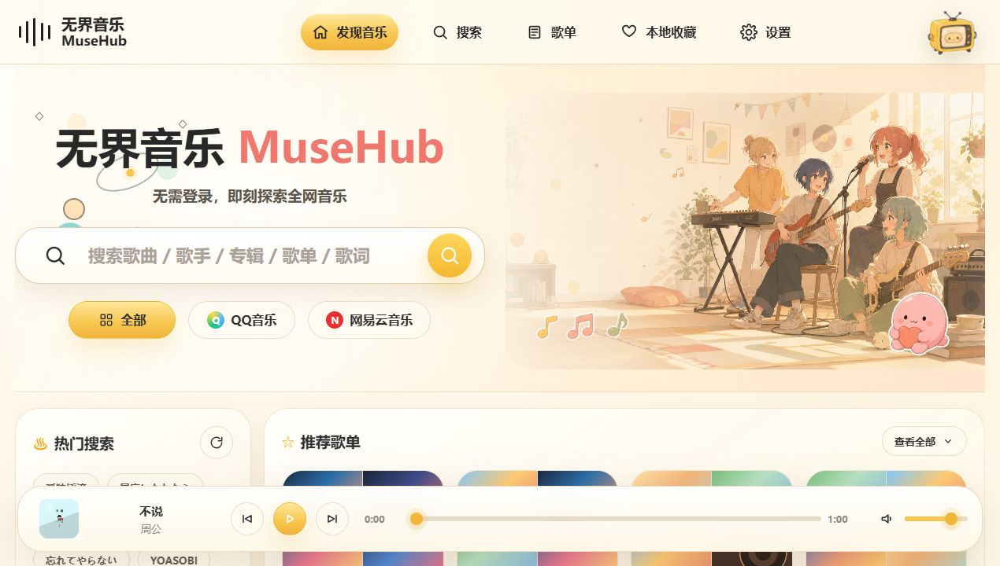

# 无界音乐 MuseHub

MuseHub 是一个温暖、圆润、纯前端的音乐聚合探索站。它围绕音乐搜索、播放、歌词、本地收藏和本地歌单构建，不需要账号系统、后端数据库或本地构建流程，适合直接发布到静态托管平台。



## 功能

- 真实音乐搜索，支持聚合 QQ 音乐与网易云音乐结果。
- 真实播放链接解析、全局播放器、播放失败兜底和轻量自动换源。
- LRC 歌词请求、解析、高亮和歌词专注页。
- 本地收藏、最近播放、稍后听、本地歌单与歌单详情。
- 设置中心联动默认来源、主题、动画、歌词显示、播放器模式和缓存管理。
- 桌面、平板、手机响应式布局，移动端 TabBar 与紧凑播放器可用。
- 本地数据导入导出、友好 Toast、404 fallback 和轻量 PWA 壳。

## 技术栈

- HTML
- CSS
- JavaScript
- Hash Router
- HTMLAudioElement
- localStorage
- Cloudflare Pages 友好的静态资源发布

## 页面

| 路由 | 页面 |
| --- | --- |
| `#/home` | 发现音乐 |
| `#/search` | 搜索结果 |
| `#/playlists` | 本地歌单 |
| `#/playlist?id=xxx` | 歌单详情 |
| `#/favorites` | 本地收藏 |
| `#/settings` | 设置中心 |
| `#/player` | 播放器详情 |
| `#/lyrics` | 歌词专注页 |

## 本地运行

项目没有构建步骤。为了获得 manifest、service worker 和静态资源行为一致的调试体验，推荐从项目根目录启动静态服务器：

```bash
python -m http.server 4174
```

然后访问：

```text
http://127.0.0.1:4174/#/home
```

直接打开 `index.html` 也能浏览大部分界面，但 service worker 不会在 `file://` 环境注册。

## Cloudflare Pages 部署

Pages 发布配置：

| 配置项 | 值 |
| --- | --- |
| Framework preset | `None` |
| Production branch | `main` |
| Build command | `exit 0` |
| Build output directory | `.` |
| Root directory | 仓库根目录 |

本项目使用 hash 路由，刷新不会依赖服务端 rewrite。根目录保留 `index.html` 作为唯一应用入口，`404.html` 用于未知路径的温柔回流。

详细步骤见 [docs/deploy-cloudflare-pages.md](./docs/deploy-cloudflare-pages.md)。

## GitHub Pages 注意事项

- 继续使用 `#/route` 形式访问页面，避免 history 路由刷新 404。
- 仓库若发布在子路径下，检查 `404.html` 根路径跳转和 `sitemap.xml` 域名是否需要按实际站点调整。
- `robots.txt` 与 `sitemap.xml` 的正式域名应在发布域名确认后替换。

## 目录结构

```text
musehub/
|-- index.html
|-- 404.html
|-- offline.html
|-- site.webmanifest
|-- sw.js
|-- robots.txt
|-- sitemap.xml
|-- assets/
|   |-- avatars/
|   |-- bg/
|   |-- covers/
|   |-- icons/
|   `-- images/
|-- css/
|-- js/
|-- docs/
`-- public/
```

## API 来源

搜索、播放链接与歌词能力接入公开音乐接口，当前使用 `api.vkeys.cn` 的 V2 音乐接口。第三方接口可用性、音源授权状态、平台限制和网络波动会影响个别歌曲是否可播。

MuseHub 不接入账号登录，不读取 QQ 音乐或网易云音乐 Cookie，不保存用户凭证，也不提供下载功能。

## 已知限制

- 搜索与播放依赖第三方公开 API，超时、无 URL 或无歌词时会退回友好提示。
- 播放链接可能过期，收藏和歌单再次播放时仍会重新解析。
- PWA 仅缓存站点静态资源，不缓存第三方 API 响应和播放 URL。
- 本地收藏、歌单和设置存放在浏览器 localStorage，清理浏览器数据会一并清除。

## 免责声明

音乐内容版权归对应平台和权利方所有。MuseHub 仅用于学习交流与个人体验，不提供会员歌曲破解、用户凭证托管或音乐下载服务。

## License

MIT. See [LICENSE](./LICENSE).
